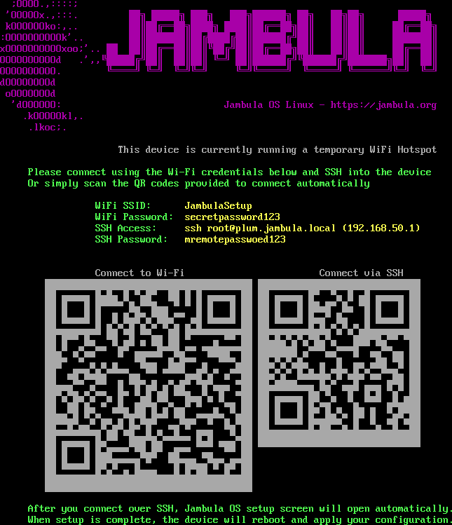
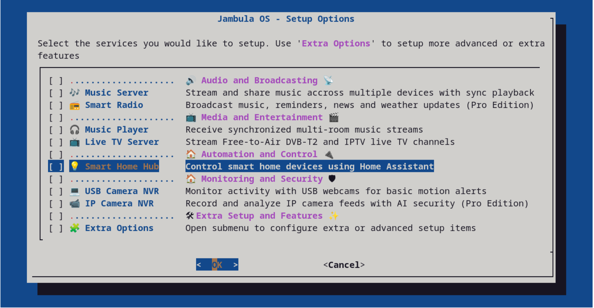
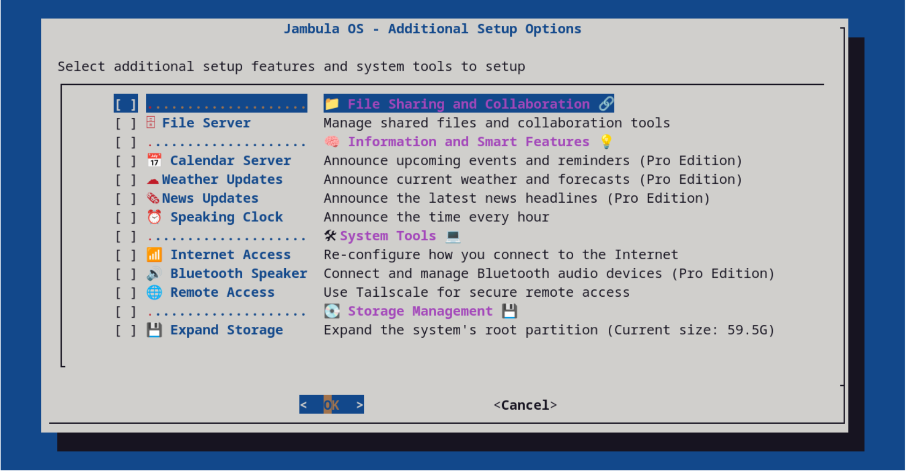

Jambula OS is a lightweight, free, and open source Linux operating system customized for deployment on embedded single board computers (SBCs), such as the popular Raspberry Pi.

This stable and efficient distribution is the ideal foundation for tech enthusiasts, developers, and the DIY/maker community especially those in the smart home space. 

Designed for maximum resilience in internet or power challenged areas, Jambula OS prioritizes a 'local-first' architecture ensuring your projects and data remain reliable, even when the connection goes offline.

It is designed for low resource hardware and provides out-of-the-box support for essential features like Wi-Fi hotspot networking and a file sharing collaboration platform.

Read more about it at: https://jambula.org

<b>Pre-requisites</b>

Currently, Jambula OS Linux is a console only platform running several open source and popular software 
services.  There's an initial ncurses style based setup program that allows you to configure the functions that
will be provided by your Raspberry Pi.  However, in order to use it effectively, you need to already be 
familiar with using Linux on the command line interface (CLI).

You will also need a Raspberry Pi 5 along with all required boot accessories, including an SD card of at least 8 GB.

<b>Supported Boards</b>

1. Raspberry Pi 5 Model B Rev 1.0

<b> How to quickly get started </b>

1. Download the latest Jambula OS image to a temporary directory:

   wget -P /tmp -c https://jambula.org/downloads/jambulaOS-202512-160919-img.7z

2. Extract the above image to a temporary directory using p7zip tool (https://www.7-zip.org/download.html)

   cd /tmp

   7za e /tmp/jambulaOS-202512-160919-img.7z

3. Burn the resulting image i.e. sdcard.img to your SD card using a tool such as dd

   For example: If your SD card is mounted at /dev/sdb enter the following command line:

   dd status=progress if=/tmp/sdcard.img of=/dev/sdb

4. Insert SD card into your raspberry pi and power it on

5. Upon initial boot, Jambula OS will present crucial setup information on the Linux 
   console, including details for connecting to the temporary Wi-Fi hotspot and the 
   necessary SSH connection command

  

6. After establishing the remote SSH connection, you will be automatically presented 
   with a setup wizard to begin configuring Jambula OS. 

  

  **NOTE:***For the optimal setup experience, it is recommended to initiate the process via 
        an SSH connection established from a remote graphical Linux desktop environment 
        like GNOME, KDE, XFCE etc.*

7. Once you successfully navigate the simple setup wizard, the system will perform an 
   automatic reboot, and Jambula OS will be fully configured and ready for use. 
   TIP: To run the setup menu again, use the command line tool: jambula-setup
  
  

8. Feel free to contribute to Jambula OS by filing detailed bug reports and submitting 
  code enhancements via Pull Requests directly to our Git repository. 

9. Finally, if you like were this is going and are able, please support my work by 
   making a contribution today.  Check out the FUNDING file for details.  You can also 
   contact me via email using: zik AT jambula.org

<b>Home-Assistant </b>

   Starting with October 2024 releases, support for Home-Assistant is included in this image.
   This means you can now use the setup menu to perform local installs and upgrades of
   Home-Assistant core. The current release includes version 2025.12.0.  However, you can also 
   upgrade to the latest upstream versions once you are connected to the internet.

<b>TO DO</b>

1. Raspberry Pi 4 and 3 series hardware support

2. Offline chat messaging

3. Photo management

4. Network and device monitoring

<b>IMPORTANT:  Support Jambula OS</b>

   Your financial support can help sustain and improve Jambula OS.  Please consider contributing 
   to this project!  Check out the FUNDING file for details or contact me direct via email using: 
   zik AT jambula.org
