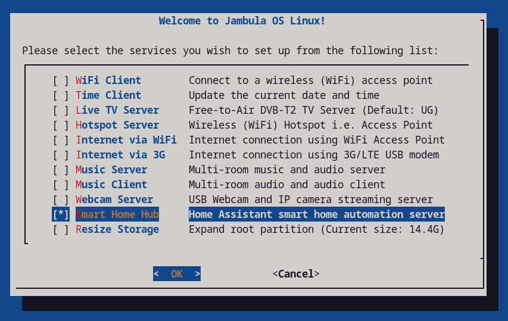

")
# Jambula-OS

Jambula OS is a custom tailored Linux operating system designed for SoC devices such as the Raspberry Pi

It is mainly used by our company i.e. Jambula Labs to build smart devices such as JambulaTV, 
a low cost and smart home hub that automates several tasks in your house or apartment while providing security and 
privacy to you and your family. Read more about it at: https://jambulatv.com

<b>Pre-requisites</b>

Currently, Jambula OS (Pi Edition) is a console only platform running several open source and popular software 
services.  There's an initial ncurses style based setup program that allows you to configure the functions that
will be provided by your Raspberry Pi.  However, in order to use it effectively, you need to already be 
familiar with using Linux on the command line interface (CLI).

You will also need a Raspberry Pi 5 device with all accessories required to boot including and SD card.  

<b>Supported Boards</b>

1. Raspberry Pi 5 Model B Rev 1.0

")

<b> How to quickly get started </b>

1. Download the latest Jambula OS image to a temporary directory:

   wget -P /tmp -c https://jambula.net/downloads/Jambula-OS/jambulaOS-202506-201631-img.7z

2. Extract the above image to a temporary directory using p7zip tool (https://www.7-zip.org/download.html)

   cd /tmp

   7za e /tmp/jambulaOS-202506-201631-img.7z

3. Burn the resulting image i.e. sdcard.img to your SD card using a tool such as dd

   For example: If your SD card is mounted at /dev/sdb enter the following command line:

   dd status=progress if=/tmp/sdcard.img of=/dev/sdb

4. Insert SD card into your raspberry pi and power it on

5. During the first boot process, Jambula OS will perform an initial system 
   configuration and reboot automatically. 

6. Upon reboot of your device, log in as root using the temporary password printed out.
   IMPORTANT: You will be prompted to change the password. Please do so immediately and 
   remember to use a strong password
  
  

7. After changing your password, the Jambula OS setup menu will appear as shown above.
   The setup menu will allow you to configure your device according to your needs.
   TIP: To run the setup menu again, use the command line tool: jambula-setup

8. Finally, if you like were this is going and are able, please support my work by 
   making a contribution today.  Check out the FUNDING file for details.  You can also 
   contact me via email using: joseph AT zikusooka.com

9. Enjoy!

<b>Home-Assistant </b>

   Starting with October 2024 releases, support for Home-Assistant is included in this image.
   This means you can now use the setup menu to perform local installs and upgrades of
   Home-Assistant core. The current release includes version 2025.5.3.  However, you can also 
   upgrade to the latest upstream versions once you are connected to the internet

<b>TO DO</b>

1. Raspberry Pi 4 and 3 series hardware support

2. File sharing and syncing

3. Network and device monitoring

<b>Support Jambula OS</b>

   Your financial support can help sustain and improve Jambula OS.  Please consider contributing 
   to this project!  Check out the FUNDING file for details or contact me direct via email using: 
   joseph AT zikusooka.com

